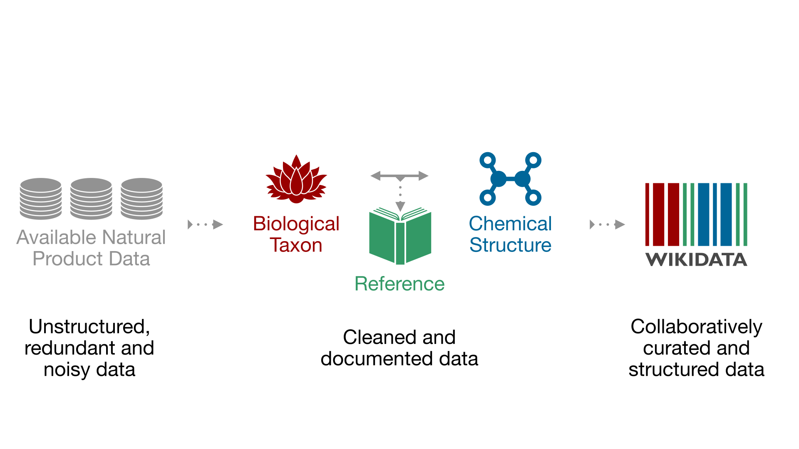

## Abstract {.page_break_before}

As bio- and chemoinformatics are reshaping natural products (NP) research, existing databases impose intrinsic and practical limits regarding access, chemical or taxonomic scope, field standardization, and interoperability. Further limitations result from essential but missing links to the primary literature, which contain the experimental information that documents structures, organisms and their relationships. Sharing such consolidated knowledge via an open platform has strong transformative potential for NP research. The LOTUS initiative has now completed the first steps towards the harmonization, curation, validation, and open dissemination of 500,000+ referenced structure-organism pairs. LOTUS data is hosted on Wikidata and regularly mirrored on [https://lotus.naturalproducts.net](https://lotus.naturalproducts.net). Data sharing within the Wikidata framework broadens data access, chemical and taxonomic scope, and interoperability, thereby overcoming many of the limitations of existing electronic resources. Furthermore, embedding LOTUS data into the vast Wikidata knowledge graph facilitates new biological and chemical insights. This opens new possibilities for community curation of data and evolving publication models. All code developed within the LOTUS initiative for data gathering, curation, and dissemination are publicly available on [https://gitlab.com/lotus7](https://gitlab.com/lotus7) and [https://github.com/mSorok/LOTUSweb](https://github.com/mSorok/LOTUSweb). Collectively, LOTUS evolves NP knowledge management to function in a world of openly shared electronic resources.

{graphical-abstract}
